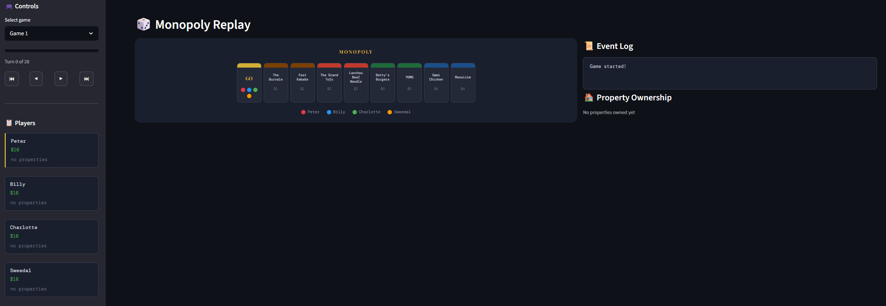
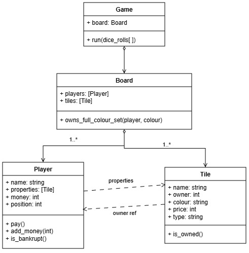
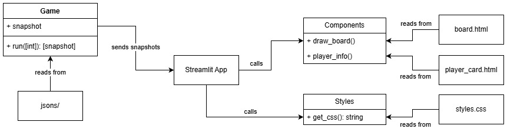

# Instructions
This application can be run either through the deployment on streamlit's community cloud or locally in the repository.

## Streamlit Cloud
Follow the link below and the the simulations can be run. The side bar holds all the controls to control the simulation, which will be displayed both on the board and in the text logs on the right column. 

[Link to my Monopoly App](https://deployment-uj3porrxxqkkm3ot9ju5tq.streamlit.app)



## GitHub
The web application can be run locally by cloning the repository and running the app.py file through streamlit. 

First install the streamlit package if it is not present already with:
```
pip install streamlit
```

Then run the application in the repository's root directory with:
```
python -m streamlit run App.py
```

# Planning
**Disclaimer:** Some methods and variables may not match in the UML diagrams as I did not update the UML as I developed the application
## Time allocation
- 16th: planning back end
- 17th - 19th: implementing back end
- 20th: planning front end
- 20th - 22nd: implementing and deploying front end

## Testing method
Iteration testing before committing each feature to make sure that only working code was pushed to the repository. This would minimise hassle at the end and ensure a relatively smooth development process. 

Mostly black box testing methods were used as I already knew the code structure and mostly preferred to test from an end-user's perspective, especially when I was about to deploy.
## Back end design
I planned to use a class based system for the backend as that was the most intuitive approach I could think of to create a simulation engine for the monopoly game. 

This design tries to adhere to SOLID design principles, where each class has a sole responsibility (e.g. "Game" class controlling the gameplay loop) and there is minimal access to internal data. Classes such as the "Player" class and "Tile" class can easily be turned into abstractions if the application demands it as well. 
### Diagram



## Front end design
Streamlit is a script that runs and re-executes on change. It can therefore import functions from other python scripts and use those functions to draw components on the page that update at each step of the game. 

The actual deployment script (App.py) is seperate to all the HTML and CSS components so that the code and project structure is readable and extendable if new elements were to be added in the future. This seperation also ensures that each file is solely responsible for one component, making it easy to understand and locate any issues that the website may have in future development.

### Diagram
